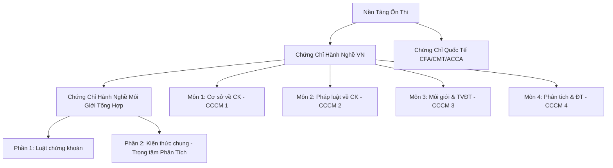

# Product Requirements Document (PRD)
## Dự Án: Nền Tảng Ôn Thi Chứng Chỉ Tài Chính (Securities & Finance Exam Prep Platform)

Tài liệu này xác định các yêu cầu nghiệp vụ, tính năng kỹ thuật và lộ trình phát triển cho ứng dụng Web ôn thi các chứng chỉ hành nghề chứng khoán (CCHN) và lộ trình mở rộng cho các chứng chỉ tài chính quốc tế như CFA, CMT, ACCA.

---

## 1. Mục Tiêu Dự Án (Objectives)
*   Xây dựng hệ thống học tập (LMS) học thuật, tối giản, trực quan giúp người dùng ôn tập và đỗ kỳ thi Chứng chỉ Hành nghề Chứng khoán của Ủy ban Chứng khoán Nhà nước (UBCKNN).
*   Đồng bộ tiến độ học tập trên đa thiết bị thông qua hệ thống tài khoản người dùng cá nhân hóa.
*   Thiết kế kiến trúc dữ liệu và hệ thống dạng module mở rộng (scalable) để dễ dàng tích hợp các bộ câu hỏi của các kỳ thi lớn khác như CFA, CMT, ACCA.
*   Chuẩn bị sẵn sàng cấu trúc dữ liệu tài liệu học tập (giáo trình, slide) để tích hợp Trợ lý AI (RAG - Retrieval-Augmented Generation) giúp giải thích chi tiết bài tập/công thức.

---

## 2. Đối Tượng Người Dùng (Target Audience)
*   Sinh viên ngành Tài chính - Ngân hàng, Kinh tế muốn lấy chứng chỉ hành nghề sớm.
*   Nhân viên tư vấn, môi giới chứng khoán (Broker) cần hoàn thành 4 chứng chỉ chuyên môn và chứng chỉ hành nghề môi giới tổng hợp theo quy chế.
*   Các chuyên viên phân tích tài chính đầu tư muốn ôn tập kiến thức chuyên sâu.

---

## 3. Kiến Trúc Dữ Liệu & Phân Cấp Chứng Chỉ (Domain Data Model)

Ứng dụng hỗ trợ cấu trúc phân cấp linh hoạt để quản lý các loại chứng chỉ:

### Quản Lý Phân Khúc Đề Thi (Question Partitioning)
Mỗi môn học sẽ chia câu hỏi thành 2 phân vùng dữ liệu (partitions) riêng biệt:
1.  **Phân vùng Đề Thi Thật (Real Questions)**: Chỉ bao gồm các câu hỏi lấy từ đề thi thực tế đã được crawl và dọn dẹp sạch sẽ (hiện tại có 475 câu).
2.  **Phân vùng Ngân Hàng Đề Thi Thử (Seed/Practice Questions)**: Bao gồm các câu hỏi ôn tập, câu hỏi trong slide, sách giáo trình (Seed questions).

---

## 4. Các Tính Năng Cốt Lõi (Key Features)

### 4.1. Hệ Thống Đăng Nhập & Hồ Sơ Người Dùng (Authentication & Profile)
*   Hỗ trợ đăng nhập qua Social (Google) và Email/Password.
*   Lưu trữ lịch sử thi, thống kê thời gian học tập, danh sách câu hỏi đã bookmark (flashcard) và tỷ lệ trả lời đúng theo thời gian thực tế.

### 4.2. Chế Độ Luyện Thi & Học Tập (Learning & Testing Modes)

| Chế độ | Mô tả tính năng | Phân vùng dữ liệu sử dụng |
| :--- | :--- | :--- |
| **Thi Thật (Real Exam)** | - Đề thi cố định **50 câu hỏi** ngẫu nhiên. - Giới hạn thời gian (45-50 phút). - Không hiển thị đáp án trong lúc làm, chỉ xem điểm và giải thích sau khi nộp bài. | **Phân vùng Đề Thi Thật (Real)** |
| **Thi Thử (Practice Test)** | - Người dùng tự chọn số lượng câu hỏi (ví dụ: 10, 20, 30, 50 câu). - Tùy chọn bật/tắt giới hạn thời gian. - Chỉ random trong ngân hàng câu hỏi ôn tập. | **Phân vùng Ngân Hàng Câu Hỏi Thử (Seed)** |
| **Luyện Tập Tự Do** | - Học theo chuyên đề/chương mục của từng môn học. - Click chọn đáp án là hiển thị ngay phản hồi Đúng/Sai và giải thích chi tiết. | Toàn bộ (Kết hợp cả hai) |
| **Flashcard** | - Chế độ học nhanh các thuật ngữ chuyên ngành, công thức tài chính (đặc biệt hữu ích cho môn 4 và CFA/CMT sau này). - Giao diện dạng thẻ lật (Lật trước: Khái niệm/Bài toán; Lật sau: Định nghĩa/Công thức/Đáp án). | Dữ liệu định nghĩa, công thức tài chính chuyên biệt |
| **Sổ Tay Câu Sai (Error Review)** | - Tự động lưu mọi câu trả lời sai của người dùng trong các phiên làm bài. - Giao diện cho phép làm lại các câu hỏi này cho đến khi chọn đúng 2 lần liên tiếp. | Tự động cập nhật |

### 4.3. Số Hóa Tài Liệu Học Tập (Document Management)
*   **Format Dễ Đọc**: Số hóa toàn bộ slide, sách giáo trình bản giấy từ dạng ảnh scan/PDF thô sang định dạng **Markdown** có phân chia heading rõ ràng, tích hợp bảng biểu và công thức toán học dưới dạng LaTeX (ví dụ: $ROE = \frac{\text{Net Income}}{\text{Equity}}$).
*   **AI Assistant Ready**: Cơ sở dữ liệu tài liệu số hóa dạng Markdown sẽ được gán metadata theo chương mục để làm nguồn dữ liệu tri thức (Knowledge Base) phục vụ việc huấn luyện Trợ lý AI giải đáp thắc mắc của học viên.

---

## 5. Yêu Cầu Giao Diện (UI/UX Requirements)
*   **Phong cách học thuật tối giản (Academic Minimalist)**: Sử dụng tone màu dịu mắt, tránh quá nhiều màu sắc sặc sỡ, tập trung vào độ tương phản văn bản cao để học viên không bị mỏi mắt khi làm bài thời gian dài.
*   **Hỗ trợ chế độ Light/Dark Mode**: Linh hoạt chuyển đổi theo môi trường học tập.
*   **Responsive Web Design**: Tối ưu hiển thị tuyệt đối trên thiết bị di động (Mobile-first) vì người dùng thường tận dụng thời gian rảnh trên điện thoại để ôn tập câu hỏi.

---

## 6. Yêu Cầu Phi Kỹ Thuật (Non-Functional Requirements)
*   **Hiệu Năng**: Thời gian tải đề thi dưới 1 giây. Việc tráo câu hỏi (shuffle) và hiển thị giải thích phải được xử lý mượt mà trên client-side để không gây trễ khi bấm nút.
*   **Kiến trúc CSDL Extensible**:
    *   Bảng `subjects` quản lý danh mục môn thi với các trường phụ thuộc (`category`, `parentSubjectId`).
    *   Bảng `questions` có cờ phân loại (`isRealExam: boolean`) để cô lập phân vùng dữ liệu như yêu cầu.
*   **Bảo mật**: Cơ chế bảo vệ đề thi để tránh việc người dùng crawl ngược lại toàn bộ ngân hàng câu hỏi chỉ bằng cách gọi API của web.

---

## 7. Lộ Trình Phát Triển (Roadmap)

### Giai Đoạn 1: Xây dựng Cơ Sở Dữ Liệu & Học Tập Cơ Bản (MVP)
*   Thiết lập hệ thống Auth và CSDL PostgreSQL/Supabase.
*   Nhập liệu ngân hàng đề thi thật và seed của 4 môn chứng khoán VN.
*   Triển khai giao diện học tập: Thi thử (Seed) và Thi thật (Real).

### Giai Đoạn 2: Flashcards & Số Hóa Giáo Trình
*   Ra mắt tính năng Flashcard học nhanh thuật ngữ và công thức.
*   Số hóa toàn bộ tài liệu PDF/Slide đã crawl thành tài liệu Markdown tương thích công thức toán học.
*   Hệ thống hóa lịch sử làm bài và sổ tay câu sai (Error Notebook).

### Giai Đoạn 3: Tích Hợp AI & Mở Rộng Chứng Chỉ
*   Tích hợp Trợ lý học tập AI (Chatbot giải thích trực tiếp dựa trên tài liệu đã số hóa).
*   Thêm danh mục môn thi mới cho CFA Level 1, CMT Level 1, ACCA.
